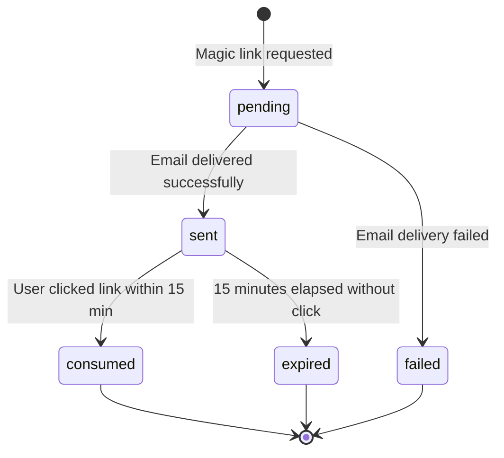
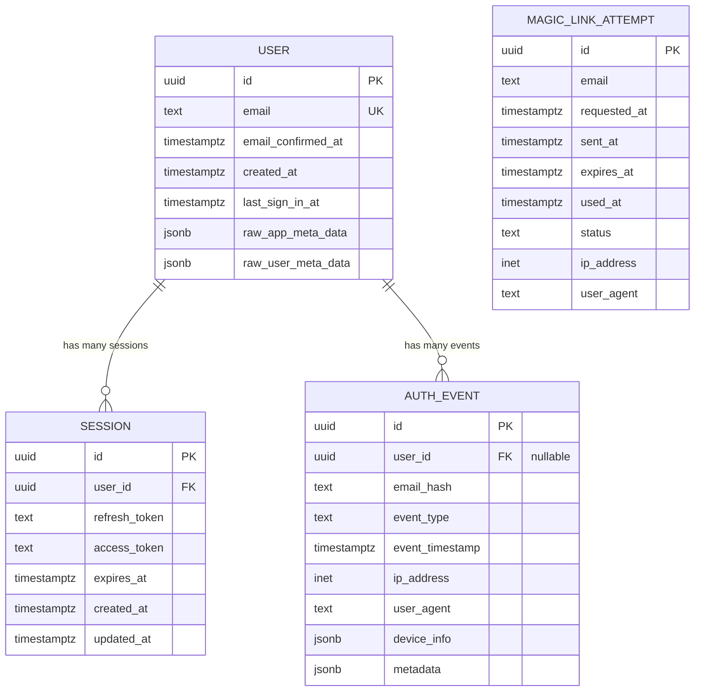
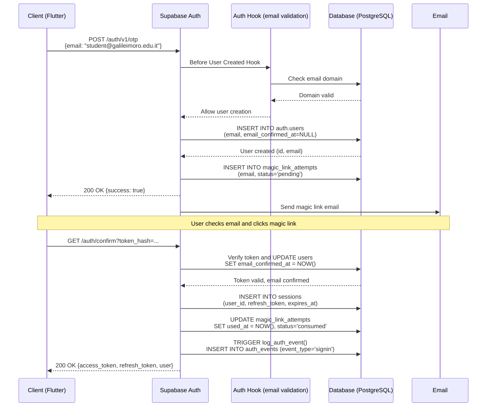
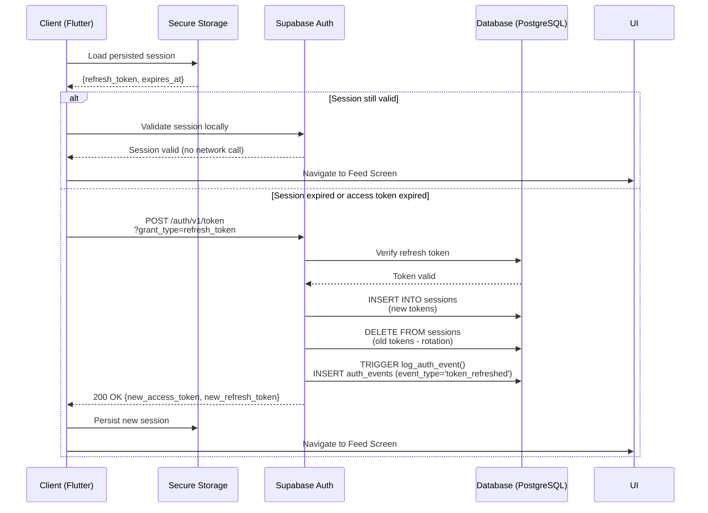
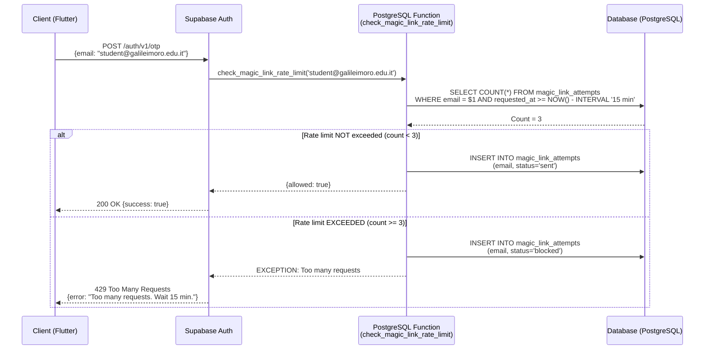

# Data Model: Magic Link Authentication

**Feature**: Passwordless Magic Link Authentication for Nova
**Version**: 1.0
**Date**: 2025-10-30
**Status**: Implementation Ready

---

## Overview

This document defines the data model for Nova's passwordless magic link authentication system. The model consists of four core entities: **User** (managed by Supabase Auth), **Session** (managed by Supabase Auth), **AuthEvent** (custom audit logging table), and **MagicLinkAttempt** (custom rate limiting table). The design prioritizes privacy (email hashing, minimal data collection), security (RLS policies, 90-day retention), and performance (optimized indexes for high-frequency queries).

---

## Entity Definitions

### 1. User

**Description**: Represents a student authenticated via magic link. Managed by Supabase Auth in the `auth.users` table with strict email domain validation (@galileimoro.edu.it only).

**Storage**: `auth.users` (Supabase managed schema)

**Fields**:

| Field Name | Type | Constraints | Description |
|------------|------|-------------|-------------|
| `id` | UUID | PRIMARY KEY, NOT NULL, DEFAULT gen_random_uuid() | Unique user identifier |
| `email` | TEXT | UNIQUE, NOT NULL | User email address (normalized to lowercase) |
| `email_confirmed_at` | TIMESTAMPTZ | NULLABLE | Timestamp when email was verified via magic link (null until first click) |
| `created_at` | TIMESTAMPTZ | NOT NULL, DEFAULT NOW() | Account creation timestamp |
| `last_sign_in_at` | TIMESTAMPTZ | NULLABLE | Most recent authentication timestamp (updated on signin and token refresh) |
| `raw_app_meta_data` | JSONB | NOT NULL, DEFAULT '{}' | Application metadata (provider: 'email', role: 'student') |
| `raw_user_meta_data` | JSONB | NOT NULL, DEFAULT '{}' | User-provided metadata (empty for magic link auth) |
| `confirmation_token` | TEXT | NULLABLE | Hashed magic link token (cleared after use) |
| `confirmation_sent_at` | TIMESTAMPTZ | NULLABLE | When magic link email was sent |

**Business Rules**:
- Email domain MUST be @galileimoro.edu.it (enforced by Before User Created hook)
- Email is normalized to lowercase before storage
- `email_confirmed_at` is set automatically upon first successful magic link click
- Each email address can only have one user account (UNIQUE constraint)
- Users are automatically created on first magic link authentication (no pre-registration)

**Relationships**:
- One-to-Many with **AuthEvent** (user_id foreign key)
- One-to-Many with **MagicLinkAttempt** (via email address lookup, not direct FK)
- One-to-Many with **Session** (user_id foreign key)

**Privacy Considerations**:
- Email addresses are stored in plaintext for authentication purposes (required for Supabase Auth)
- In audit tables, emails are hashed with SHA256 for privacy (see AuthEvent)
- No sensitive personal data collected beyond email address
- GDPR Right to Erasure supported via account deletion workflow

---

### 2. Session

**Description**: Represents an active authentication session for a user on a specific device. Managed entirely by Supabase Auth using OAuth2-style refresh token pattern with automatic rotation.

**Storage**: `auth.sessions` (Supabase managed schema)

**Fields**:

| Field Name | Type | Constraints | Description |
|------------|------|-------------|-------------|
| `id` | UUID | PRIMARY KEY, NOT NULL | Unique session identifier |
| `user_id` | UUID | FOREIGN KEY (auth.users.id), NOT NULL | User who owns this session |
| `refresh_token` | TEXT | NOT NULL | Refresh token (single-use, rotates on refresh) |
| `access_token` | TEXT | NOT NULL | Short-lived JWT access token |
| `expires_at` | TIMESTAMPTZ | NOT NULL | Refresh token expiration timestamp (30 days from creation) |
| `created_at` | TIMESTAMPTZ | NOT NULL, DEFAULT NOW() | Session creation timestamp |
| `updated_at` | TIMESTAMPTZ | NOT NULL, DEFAULT NOW() | Last refresh timestamp |

**Token Lifecycle**:
- **Access Token**: Expires after 1 hour, used for API authentication
- **Refresh Token**: Expires after 30 days, single-use with automatic rotation
- **Token Refresh**: Automatic via supabase-flutter client, exchanges old refresh token for new access + refresh token pair
- **Session Termination**: Manual logout or 30-day expiration (whichever comes first)

**Business Rules**:
- Each device gets an independent session (multi-device support)
- Refresh tokens are single-use to prevent replay attacks
- Token rotation happens automatically when access token nears expiration
- Sessions persist across app restarts via platform-specific secure storage (iOS Keychain, Android EncryptedSharedPreferences)
- Logout terminates only the current device's session (other devices remain authenticated)

**Relationships**:
- Many-to-One with **User** (user_id foreign key)

**Security Considerations**:
- Refresh tokens stored encrypted in database
- Access tokens transmitted only over HTTPS (TLS 1.2+)
- Tokens never logged or exposed in client-side error messages
- Automatic token rotation prevents long-lived token compromise

---

### 3. AuthEvent

**Description**: Custom audit table logging all authentication events for security monitoring, troubleshooting, and GDPR compliance. Captures signup, signin, signout, session expirations, token refreshes, and failed authentication attempts.

**Storage**: `public.auth_events` (custom table)

**Fields**:

| Field Name | Type | Constraints | Description |
|------------|------|-------------|-------------|
| `id` | UUID | PRIMARY KEY, NOT NULL, DEFAULT gen_random_uuid() | Unique event identifier |
| `user_id` | UUID | FOREIGN KEY (auth.users.id) ON DELETE SET NULL, NULLABLE | User who triggered event (null for failed signin attempts) |
| `email_hash` | TEXT | NOT NULL | SHA256 hash of normalized email (privacy-preserving identifier) |
| `event_type` | TEXT | NOT NULL | Event type: 'signup', 'signin', 'signout', 'session_expired', 'token_refreshed', 'failed_signin' |
| `event_timestamp` | TIMESTAMPTZ | NOT NULL, DEFAULT NOW() | When event occurred |
| `ip_address` | INET | NULLABLE | Client IP address (if available) |
| `user_agent` | TEXT | NULLABLE | Browser/device user agent string |
| `device_info` | JSONB | NULLABLE | Structured device metadata: { platform: 'iOS', version: '16.0', app_version: '1.0.0' } |
| `metadata` | JSONB | NULLABLE | Event-specific data: { reason: 'manual', provider: 'email', error_code: '...' } |

**Indexes**:
```sql
CREATE INDEX idx_auth_events_user_time ON public.auth_events(user_id, event_timestamp DESC);
CREATE INDEX idx_auth_events_type_time ON public.auth_events(event_type, event_timestamp DESC);
CREATE INDEX idx_auth_events_email_hash ON public.auth_events(email_hash);
CREATE INDEX idx_auth_events_timestamp ON public.auth_events(event_timestamp DESC);
```

**Event Types**:

| Event Type | Trigger | Example Metadata |
|------------|---------|------------------|
| `signup` | First account creation | `{ provider: 'email', email_confirmed: false }` |
| `signin` | Successful authentication | `{ method: 'magic_link' }` or `{ method: 'session_refresh' }` |
| `signout` | Manual logout | `{ reason: 'manual', device: 'iOS' }` |
| `session_expired` | Automatic session expiration | `{ reason: 'token_expired', last_activity: '2025-10-01T10:00:00Z' }` |
| `token_refreshed` | Background token refresh | `{ old_token_age: 3540 }` (seconds since last refresh) |
| `failed_signin` | Authentication failure | `{ reason: 'invalid_domain', error_code: 403 }` or `{ reason: 'rate_limit', retry_after: 900 }` |

**Retention Policy**:
- Events older than 90 days are automatically deleted via scheduled cleanup function
- Deletion runs daily at 2:00 AM UTC
- Retention period balances security monitoring needs with GDPR data minimization

**Row-Level Security Policies**:
```sql
-- Service role can insert events
CREATE POLICY "Service role can insert events"
  ON public.auth_events FOR INSERT
  TO service_role
  WITH CHECK (true);

-- Authenticated users can read their own events
CREATE POLICY "Users can read own events"
  ON public.auth_events FOR SELECT
  TO authenticated
  USING (auth.uid() = user_id);

-- No update or delete (immutable audit log)
```

**Business Rules**:
- Events are immutable (no updates or deletes except automated cleanup)
- Email addresses are hashed with SHA256 for privacy (cannot reverse-lookup email from hash)
- Failed signin attempts store email hash but no user_id (user may not exist)
- IP addresses and user agents are optional (may not be available in all contexts)
- Device info is populated client-side and sent with authentication requests

**Relationships**:
- Many-to-One with **User** (user_id foreign key, nullable)

**Privacy Considerations**:
- Email hashing prevents PII leakage in audit logs
- 90-day retention minimizes data storage duration
- IP addresses stored only for security monitoring (GDPR legitimate interest)
- No sensitive data (tokens, passwords) logged
- Users can request audit log export for GDPR data portability

---

### 4. MagicLinkAttempt

**Description**: Custom tracking table for magic link requests, used for rate limiting (3 requests per 15 minutes) and abuse detection. Tracks all magic link send attempts with status and timing metadata.

**Storage**: `public.magic_link_attempts` (custom table)

**Fields**:

| Field Name | Type | Constraints | Description |
|------------|------|-------------|-------------|
| `id` | UUID | PRIMARY KEY, NOT NULL, DEFAULT gen_random_uuid() | Unique attempt identifier |
| `email` | TEXT | NOT NULL | Email address (normalized to lowercase) |
| `requested_at` | TIMESTAMPTZ | NOT NULL, DEFAULT NOW() | When magic link was requested |
| `sent_at` | TIMESTAMPTZ | NULLABLE | When email was successfully sent (null if failed) |
| `expires_at` | TIMESTAMPTZ | NOT NULL, DEFAULT NOW() + INTERVAL '15 minutes' | Magic link expiration timestamp |
| `used_at` | TIMESTAMPTZ | NULLABLE | When magic link was clicked and consumed (null if unused) |
| `status` | TEXT | NOT NULL | Current status: 'pending', 'sent', 'expired', 'consumed', 'failed' |
| `ip_address` | INET | NULLABLE | Client IP address (for abuse detection) |
| `user_agent` | TEXT | NULLABLE | Browser/device user agent string |

**Indexes**:
```sql
CREATE INDEX idx_magic_link_attempts_email_time ON public.magic_link_attempts(email, requested_at DESC);
CREATE INDEX idx_magic_link_attempts_status ON public.magic_link_attempts(status, requested_at DESC);
CREATE INDEX idx_magic_link_attempts_ip ON public.magic_link_attempts(ip_address, requested_at DESC);
```

**State Transitions**:



**Status Definitions**:

| Status | Description | Transition From | Transition To |
|--------|-------------|-----------------|---------------|
| `pending` | Magic link request initiated, email not yet sent | (initial state) | `sent`, `failed` |
| `sent` | Email successfully delivered to user's inbox | `pending` | `consumed`, `expired` |
| `expired` | Magic link expired (15 minutes elapsed without use) | `sent` | (terminal state) |
| `consumed` | User clicked magic link and successfully authenticated | `sent` | (terminal state) |
| `failed` | Email delivery failed (SMTP error, invalid email, etc.) | `pending` | (terminal state) |

**Business Rules**:
- Rate limiting: Maximum 3 attempts per email per 15-minute sliding window
- Attempts are counted only if status is 'sent' or 'pending' (failed attempts don't count toward limit)
- Expired and consumed links are kept for audit purposes but don't affect rate limiting
- IP-based rate limiting not enforced but IP addresses stored for future abuse detection

**Row-Level Security Policies**:
```sql
-- Service role can insert and update attempts
CREATE POLICY "Service role can manage attempts"
  ON public.magic_link_attempts FOR ALL
  TO service_role
  USING (true)
  WITH CHECK (true);

-- No direct access for authenticated users (accessed via PostgreSQL functions only)
```

**Rate Limiting Query**:
```sql
-- Check if email has exceeded rate limit
SELECT COUNT(*)
FROM public.magic_link_attempts
WHERE email = $1
  AND requested_at >= NOW() - INTERVAL '15 minutes'
  AND status IN ('sent', 'pending');

-- If count >= 3, reject with "Too many requests" error
```

**Relationships**:
- No direct foreign keys (email-based lookup only)
- Logically related to **User** via email address
- Used by rate limiting PostgreSQL function `check_magic_link_rate_limit()`

**Cleanup Policy**:
- Records older than 90 days are automatically deleted (same retention as AuthEvent)
- Old records no longer affect rate limiting (15-minute sliding window)
- Retention supports audit and abuse pattern analysis

---

## Entity-Relationship Diagram



**Relationship Details**:

1. **User → Session** (One-to-Many)
   - Foreign Key: `sessions.user_id` references `users.id`
   - Cardinality: One user can have multiple active sessions (multi-device support)
   - Cascade: ON DELETE CASCADE (sessions deleted when user account deleted)

2. **User → AuthEvent** (One-to-Many)
   - Foreign Key: `auth_events.user_id` references `users.id`
   - Cardinality: One user generates many authentication events over time
   - Cascade: ON DELETE SET NULL (preserve audit logs even after user deletion)
   - Note: user_id can be null for failed signin attempts where user doesn't exist

3. **User ↔ MagicLinkAttempt** (Implicit, No FK)
   - Relationship: Logically related via email address (no database FK)
   - Rationale: Magic links can be requested for non-existent users (first-time signup)
   - Lookup: Email-based queries to check rate limiting before user creation

---

## Data Flow Diagrams

### 1. First-Time User Signup Flow



### 2. Returning User Authentication Flow



### 3. Rate Limiting Flow



---

## Privacy Considerations

### Email Hashing Strategy

**Rationale**: Email addresses in audit logs (AuthEvent table) are hashed to prevent PII exposure while maintaining ability to analyze patterns.

**Implementation**:
```sql
-- PostgreSQL function for consistent hashing
CREATE FUNCTION public.hash_email(email TEXT)
RETURNS TEXT
LANGUAGE plpgsql
IMMUTABLE
AS $$
BEGIN
  RETURN encode(digest(LOWER(TRIM(email)), 'sha256'), 'hex');
END;
$$;
```

**Usage**:
```sql
-- Hashing during event logging
INSERT INTO public.auth_events (user_id, email_hash, event_type)
VALUES (
  'user-uuid-here',
  public.hash_email('Student@galileimoro.edu.it'),
  'signin'
);
```

**Trade-offs**:
- **Benefit**: Audit logs don't contain plaintext emails (GDPR data minimization)
- **Benefit**: Rainbow table attacks impractical (email space is large)
- **Limitation**: Cannot reverse-lookup email from hash (by design)
- **Limitation**: Cannot perform partial email searches (e.g., find all events for @galileimoro.edu.it)

### Data Retention

**90-Day Retention Policy**:
- AuthEvent records older than 90 days are deleted automatically
- MagicLinkAttempt records older than 90 days are deleted automatically
- Balances security monitoring needs (recent activity analysis) with GDPR data minimization

**Cleanup Implementation**:
```sql
CREATE FUNCTION public.cleanup_old_auth_events()
RETURNS void
LANGUAGE plpgsql
SECURITY DEFINER
AS $$
BEGIN
  DELETE FROM public.auth_events
  WHERE event_timestamp < NOW() - INTERVAL '90 days';

  DELETE FROM public.magic_link_attempts
  WHERE requested_at < NOW() - INTERVAL '90 days';
END;
$$;

-- Schedule via pg_cron (requires pg_cron extension)
SELECT cron.schedule(
  'cleanup-auth-events',
  '0 2 * * *',  -- Daily at 2:00 AM UTC
  'SELECT public.cleanup_old_auth_events()'
);
```

### GDPR Compliance

**Right to Erasure (Article 17)**:
- Users can delete their account via Settings screen
- Deletion removes User record and cascades to Sessions
- AuthEvent records preserve user_id but set it to NULL (anonymized audit trail)
- Email hashes remain for statistical analysis (not considered PII)

**Right to Data Portability (Article 20)**:
- Users can export their authentication history via API endpoint
- Export includes: signin timestamps, device metadata, session durations
- Email hashes not included in export (not useful to user)

**Data Minimization (Article 5)**:
- Only email address collected during authentication (no name, phone, address)
- IP addresses stored only for security monitoring (legitimate interest)
- Device metadata limited to platform, version, app version (no device IDs)

---

## Performance Considerations

### Index Strategy

**Critical Indexes** (must be present for production performance):

```sql
-- AuthEvent indexes (high read volume)
CREATE INDEX idx_auth_events_user_time
  ON public.auth_events(user_id, event_timestamp DESC);
  -- Supports: User-specific event queries with time ordering

CREATE INDEX idx_auth_events_type_time
  ON public.auth_events(event_type, event_timestamp DESC);
  -- Supports: Event type filtering with time ordering (e.g., all failed_signin events)

CREATE INDEX idx_auth_events_email_hash
  ON public.auth_events(email_hash);
  -- Supports: Email-based event lookup (e.g., find all events for hashed email)

CREATE INDEX idx_auth_events_timestamp
  ON public.auth_events(event_timestamp DESC);
  -- Supports: Recent activity queries and cleanup operations

-- MagicLinkAttempt indexes (high write volume)
CREATE INDEX idx_magic_link_attempts_email_time
  ON public.magic_link_attempts(email, requested_at DESC);
  -- Supports: Rate limiting queries (count recent attempts per email)

CREATE INDEX idx_magic_link_attempts_status
  ON public.magic_link_attempts(status, requested_at DESC);
  -- Supports: Status-based filtering (e.g., find all 'blocked' attempts)

CREATE INDEX idx_magic_link_attempts_ip
  ON public.magic_link_attempts(ip_address, requested_at DESC);
  -- Supports: IP-based abuse detection (future feature)
```

### Query Performance Budgets

**Authentication Flow** (critical path):
- User session check: <10ms (indexed lookup on auth.sessions)
- Magic link rate limiting check: <50ms (indexed COUNT query on 15-minute window)
- Auth event logging: <20ms (INSERT with automatic trigger)

**Analytics Queries** (non-critical path):
- Daily active users (last 7 days): <200ms
- Authentication success rate (last 24 hours): <100ms
- Recent failed signin attempts: <150ms

### Write Amplification

**Concern**: Every authentication event triggers writes to multiple tables:
1. auth.users (UPDATE last_sign_in_at)
2. auth.sessions (INSERT new session or UPDATE existing)
3. public.auth_events (INSERT via trigger)
4. public.magic_link_attempts (INSERT on magic link request)

**Mitigation**:
- Triggers use AFTER INSERT/UPDATE to avoid blocking authentication flow
- Indexes designed to minimize write overhead (only essential indexes)
- Batch cleanup operations run during low-traffic hours (2:00 AM UTC)

---

## Security Considerations

### Row-Level Security (RLS)

**AuthEvent Table**:
```sql
-- Enable RLS
ALTER TABLE public.auth_events ENABLE ROW LEVEL SECURITY;

-- Service role can insert (for triggers and application logging)
CREATE POLICY "Service role can insert events"
  ON public.auth_events FOR INSERT
  TO service_role
  WITH CHECK (true);

-- Authenticated users can read only their own events
CREATE POLICY "Users can read own events"
  ON public.auth_events FOR SELECT
  TO authenticated
  USING (auth.uid() = user_id);

-- No updates or deletes (immutable audit log)
-- Cleanup function runs with SECURITY DEFINER (bypasses RLS)
```

**MagicLinkAttempt Table**:
```sql
-- Enable RLS
ALTER TABLE public.magic_link_attempts ENABLE ROW LEVEL SECURITY;

-- Service role can manage (for rate limiting function)
CREATE POLICY "Service role can manage attempts"
  ON public.magic_link_attempts FOR ALL
  TO service_role
  USING (true)
  WITH CHECK (true);

-- No direct access for authenticated users
-- Accessed only via PostgreSQL functions with SECURITY DEFINER
```

### Token Security

**Refresh Token Storage**:
- Stored encrypted in database (Supabase handles encryption at rest)
- Never transmitted in URL parameters (POST body only)
- Single-use with automatic rotation (prevents replay attacks)

**Access Token Security**:
- Short-lived (1 hour) to minimize exposure window
- JWT format with signature verification
- Transmitted only over HTTPS with TLS 1.2+

---

## Testing Strategy

### Unit Tests

**Email Hashing Function**:
```sql
-- Test consistent hashing
SELECT public.hash_email('Student@galileimoro.edu.it') =
       public.hash_email('student@galileimoro.edu.it'); -- Should be TRUE

-- Test non-empty hash
SELECT public.hash_email('test@galileimoro.edu.it') IS NOT NULL; -- Should be TRUE

-- Test hash length (SHA256 hex = 64 characters)
SELECT LENGTH(public.hash_email('test@galileimoro.edu.it')) = 64; -- Should be TRUE
```

**Rate Limiting Logic**:
```sql
-- Test rate limit enforcement
-- Insert 3 attempts within 15 minutes
INSERT INTO public.magic_link_attempts (email, requested_at, status)
VALUES
  ('test@galileimoro.edu.it', NOW() - INTERVAL '5 minutes', 'sent'),
  ('test@galileimoro.edu.it', NOW() - INTERVAL '10 minutes', 'sent'),
  ('test@galileimoro.edu.it', NOW() - INTERVAL '14 minutes', 'sent');

-- Next attempt should be blocked
SELECT COUNT(*) >= 3
FROM public.magic_link_attempts
WHERE email = 'test@galileimoro.edu.it'
  AND requested_at >= NOW() - INTERVAL '15 minutes'
  AND status IN ('sent', 'pending'); -- Should be TRUE
```

### Integration Tests

**Authentication Flow Test**:
1. Request magic link for new email
2. Verify MagicLinkAttempt record created with status='pending'
3. Verify User record created with email_confirmed_at=NULL
4. Simulate magic link click (token verification)
5. Verify User.email_confirmed_at updated
6. Verify Session created with 30-day expiration
7. Verify AuthEvent logged with event_type='signin'

**Rate Limiting Test**:
1. Request 3 magic links within 15 minutes
2. Verify all 3 succeed
3. Request 4th magic link immediately
4. Verify 429 Too Many Requests error
5. Wait 15 minutes
6. Verify magic link request succeeds again

### Performance Tests

**Load Test Scenarios**:
- 100 concurrent magic link requests (test rate limiting under load)
- 1000 concurrent session checks (test returning user authentication)
- 500 auth event queries (test analytics performance)

**Performance Assertions**:
- Magic link request: p95 < 2 seconds
- Session check: p95 < 100ms
- Auth event logging: p95 < 50ms
- Rate limiting check: p95 < 100ms

---

## Migration Strategy

### Initial Schema Deployment

**Order of Operations** (dependency-aware):

1. **Create custom tables**:
   ```sql
   CREATE TABLE public.auth_events (...);
   CREATE TABLE public.magic_link_attempts (...);
   ```

2. **Create helper functions**:
   ```sql
   CREATE FUNCTION public.hash_email(...);
   CREATE FUNCTION public.check_magic_link_rate_limit(...);
   CREATE FUNCTION public.cleanup_old_auth_events(...);
   ```

3. **Create triggers**:
   ```sql
   CREATE FUNCTION public.log_auth_event() RETURNS TRIGGER ...;
   CREATE TRIGGER trigger_log_auth_events
     AFTER INSERT OR UPDATE ON auth.users
     FOR EACH ROW EXECUTE FUNCTION public.log_auth_event();
   ```

4. **Enable RLS and create policies**:
   ```sql
   ALTER TABLE public.auth_events ENABLE ROW LEVEL SECURITY;
   CREATE POLICY "Service role can insert events" ...;
   CREATE POLICY "Users can read own events" ...;
   ```

5. **Create indexes**:
   ```sql
   CREATE INDEX idx_auth_events_user_time ...;
   CREATE INDEX idx_magic_link_attempts_email_time ...;
   ```

6. **Schedule cleanup job** (requires pg_cron extension):
   ```sql
   SELECT cron.schedule('cleanup-auth-events', ...);
   ```

### Rollback Strategy

If migration fails, rollback in reverse order:

```sql
-- 1. Remove scheduled job
SELECT cron.unschedule('cleanup-auth-events');

-- 2. Drop indexes
DROP INDEX IF EXISTS idx_auth_events_user_time;
DROP INDEX IF EXISTS idx_magic_link_attempts_email_time;
-- ... (drop all indexes)

-- 3. Drop RLS policies
DROP POLICY IF EXISTS "Service role can insert events" ON public.auth_events;
DROP POLICY IF EXISTS "Users can read own events" ON public.auth_events;
-- ... (drop all policies)

-- 4. Disable RLS
ALTER TABLE public.auth_events DISABLE ROW LEVEL SECURITY;
ALTER TABLE public.magic_link_attempts DISABLE ROW LEVEL SECURITY;

-- 5. Drop triggers
DROP TRIGGER IF EXISTS trigger_log_auth_events ON auth.users;

-- 6. Drop functions
DROP FUNCTION IF EXISTS public.log_auth_event();
DROP FUNCTION IF EXISTS public.check_magic_link_rate_limit();
DROP FUNCTION IF EXISTS public.cleanup_old_auth_events();
DROP FUNCTION IF EXISTS public.hash_email();

-- 7. Drop tables
DROP TABLE IF EXISTS public.magic_link_attempts;
DROP TABLE IF EXISTS public.auth_events;
```

---

## Appendix: Sample Queries

### Analytics Queries

**Daily Active Users (Last 7 Days)**:
```sql
SELECT
  DATE(event_timestamp) AS date,
  COUNT(DISTINCT user_id) AS daily_active_users
FROM public.auth_events
WHERE event_type IN ('signin', 'signup')
  AND event_timestamp >= NOW() - INTERVAL '7 days'
GROUP BY DATE(event_timestamp)
ORDER BY date DESC;
```

**Authentication Success Rate (Last 24 Hours)**:
```sql
SELECT
  COUNT(*) FILTER (WHERE event_type IN ('signin', 'signup')) AS successful_auths,
  COUNT(*) FILTER (WHERE event_type = 'failed_signin') AS failed_auths,
  ROUND(
    100.0 * COUNT(*) FILTER (WHERE event_type IN ('signin', 'signup')) /
    NULLIF(COUNT(*), 0),
    2
  ) AS success_rate_percent
FROM public.auth_events
WHERE event_timestamp >= NOW() - INTERVAL '24 hours';
```

**Users Hitting Rate Limits (Last 7 Days)**:
```sql
SELECT
  email,
  COUNT(*) AS total_attempts,
  COUNT(*) FILTER (WHERE status = 'blocked') AS blocked_attempts,
  MAX(requested_at) AS last_attempt
FROM public.magic_link_attempts
WHERE requested_at >= NOW() - INTERVAL '7 days'
GROUP BY email
HAVING COUNT(*) FILTER (WHERE status = 'blocked') > 3
ORDER BY blocked_attempts DESC;
```

**Average Session Duration**:
```sql
WITH session_starts AS (
  SELECT user_id, event_timestamp AS start_time
  FROM public.auth_events
  WHERE event_type IN ('signin', 'signup')
),
session_ends AS (
  SELECT user_id, event_timestamp AS end_time
  FROM public.auth_events
  WHERE event_type IN ('signout', 'session_expired')
)
SELECT
  AVG(end_time - start_time) AS avg_session_duration
FROM session_starts
JOIN session_ends USING (user_id)
WHERE end_time > start_time;
```

---

**Document Version**: 1.0
**Last Updated**: 2025-10-30
**Status**: Implementation Ready
**Dependencies**: research.md (technical decisions), spec.md (requirements)
**Next Steps**: Create contracts/ directory with API contracts and database schema
